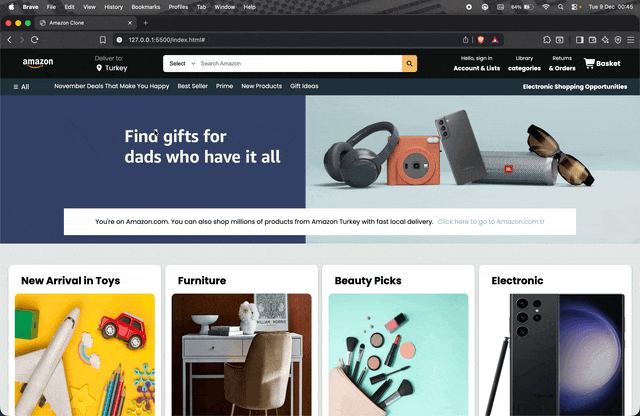

# Amazon Clone Website 🛒

This project features a simple **Amazon Clone** website design and functionality. It was built using **HTML** and **CSS** to create a fully **responsive** (mobile-friendly) layout.

## 🚀 Features

- **Responsive Design**: The website is designed to work seamlessly across all devices (mobile, tablet, desktop).
- **Product List**: A section on the homepage displays a list of products.
- **Navigation Menu**: A practical navigation menu for quick access to categories and pages.
- **Product Detail Page**: A detailed page for each product.
- **Cart Feature**: Allows users to add and remove products from the shopping cart.

## 🛠️ Technologies Used

- **HTML5**: Used for structuring the content.
- **CSS3**: Used for styling and layout.
- **Responsive Design**: Media queries were used to ensure the design is compatible across different devices.

## 🎥 Screen Gif

